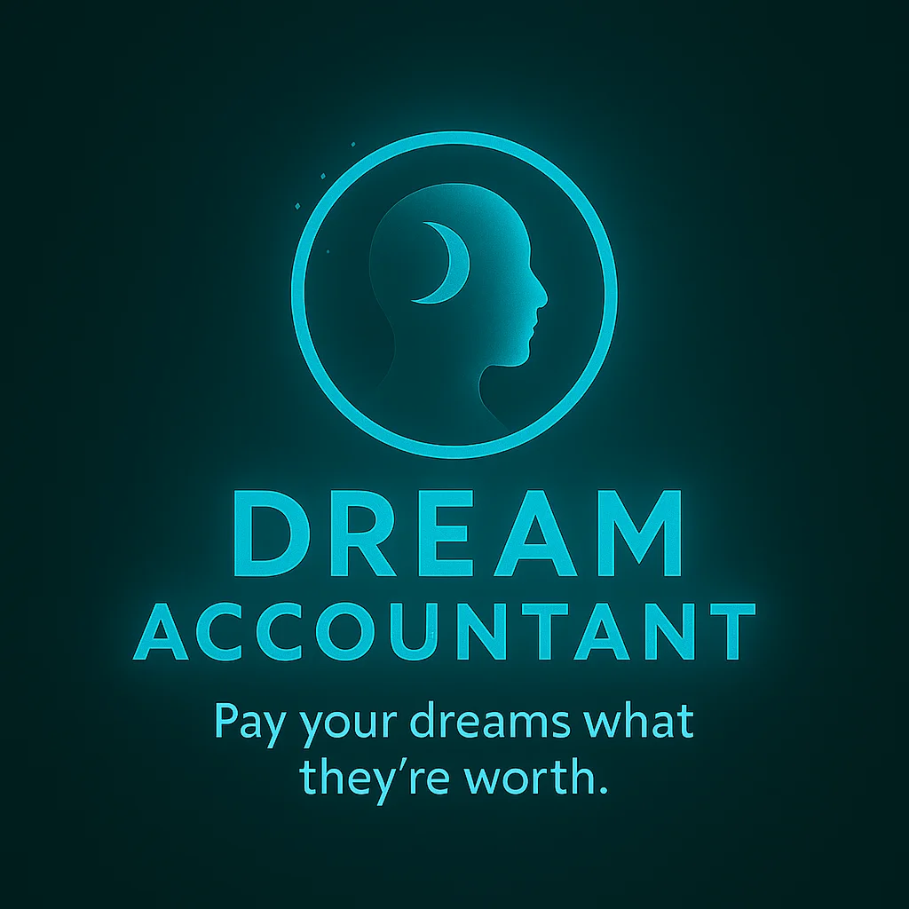

# 💭 Dream Accountant

**Pay your dreams what they're worth**

[View Live Demo →](https://[your-username].github.io/dream-accountant)



---

## 📱 About the Project

Dream Accountant is an innovative mobile application concept that reimagines personal goal achievement as a journey of intentional value allocation. Instead of viewing aspirations as distant wishes, users transform their dreams into tangible actions with assigned value, creating a direct connection between daily progress and meaningful life goals.

### The Core Concept

- **Dream-Driven Action**: Users define their personal dreams (writing a novel, learning a language, mastering an instrument)
- **Actionable Breakdown**: Dreams are broken down into concrete, achievable tasks
- **Value Assignment**: Each action is assigned a value, creating a clear connection between effort and progress
- **Progress Tracking**: Visual progress reports show both dream completion and overall achievement

---

## ✨ Features Showcase

This repository contains a complete GUI mockup showcasing 6 key screens:

### 🎯 Core Screens

1. **Welcome / Onboarding** - First-time user experience introducing the app's unique approach
2. **Home / Dream Ledger** - Overview of total progress, active dreams, and key metrics
3. **Dream Capture** - Simple form for adding new dreams with icon selection
4. **Progress & Reports** - Analytics and insights on your achievement journey
5. **Pay With Action Wizard** - Step-by-step process for breaking down dreams into actions
6. **Invoice Detail** - Deep dive into individual dream progress and recent activity

---

## 🎨 Design System

### Brand Identity

The Dream Accountant brand features a distinctive visual language that balances aspiration with clarity, using a cohesive color palette and modern design patterns.

#### Color Palette

| Color | Hex Code | Usage |
|-------|----------|-------|
| Midnight Indigo | `#0A0F1F` | Primary background |
| Neon Cyan | `#25E6E6` | Primary accent, CTAs |
| Muted Gold | `#E0B86F` | Secondary accent, labels |
| Slate | `#1E2435` | Card backgrounds |
| Cloud | `#F5F7FA` | Primary text |
| Soft Red | `#FF6B6B` | Warning states |

#### Typography

- **Display**: Inter Tight / SF Pro Display (700-900 weight)
- **Body**: Inter / SF Pro Text (400-600 weight)
- **Special Effects**: Gradient overlays, glow effects, generous letter-spacing

#### Visual Effects

- **Card Shadows**: `0 8px 30px rgba(0, 0, 0, 0.35)`
- **Glow Accents**: `0 0 24px rgba(37, 230, 230, 0.4)`
- **Border Treatment**: `1px solid rgba(255, 255, 255, 0.08)`
- **Border Radius**: 12px for cards, 16px for chips, 40px for phone frames

---

## 🚀 Viewing the Mockups

### Live Demo

Visit the GitHub Pages site to interact with the mockups:
```
https://[your-username].github.io/dream-accountant
```

### Local Development

1. **Clone the repository**
   ```bash
   git clone https://github.com/[your-username]/dream-accountant.git
   cd dream-accountant
   ```

2. **Open in browser**
   ```bash
   # Simply open index.html in your web browser
   open index.html  # macOS
   # or
   start index.html # Windows
   ```

No build process required! The mockups are pure HTML/CSS with no dependencies.

---

## 📂 Project Structure

```
dream-accountant/
├── index.html              # Main mockup showcase
├── Locked_logo.png        # App logo (locked/final version)
├── README.md              # This file
└── LICENSE                # MIT License
```

---

## 💡 Business Concept

### Target Market

- **Primary**: Millennials and Gen Z seeking meaningful goal achievement
- **Secondary**: Anyone pursuing personal development and life goals
- **Tertiary**: Self-improvement enthusiasts looking for structure and accountability

### Value Proposition

Traditional goal-tracking apps focus on task completion without emotional connection. Dream Accountant reframes the conversation:

- ✅ **Focus on aspirations** rather than obligations
- ✅ **Positive reinforcement** through progress visualization
- ✅ **Tangible connection** between daily actions and life dreams
- ✅ **Gamification** without trivializing meaningful pursuits

### Revenue Model (Proposed)

1. **Freemium Tier**: Basic dream tracking, limited to 3 active dreams
2. **Premium Tier** ($9.99/month): Unlimited dreams, advanced analytics, custom actions
3. **Coaching Marketplace**: Connect users with life coaches, writing mentors, skill trainers
4. **B2B Licensing**: Partner with educational institutions and corporate wellness programs

---

## 🛠️ Technical Implementation Notes

### Current State

This repository contains **static GUI mockups** built with:
- Pure HTML5
- CSS3 (with custom properties and gradients)
- No JavaScript frameworks
- Responsive design principles
- Mobile-first approach

### Future Development Path

For a production application, the recommended stack would include:

**Mobile App**
- React Native or Flutter for cross-platform development
- Redux or MobX for state management
- Firebase or AWS Amplify for backend services

**Web App**
- React or Vue.js frontend
- Node.js + Express backend
- PostgreSQL or MongoDB database
- REST or GraphQL API

**Key Features to Implement**
- User authentication and profiles
- Cloud sync across devices
- Push notifications for scheduled actions
- Social features (share progress, find accountability partners)
- AI-powered action suggestions
- Integration with calendar apps
- Achievement system (streaks, badges, milestones)

---

## 📊 Class Presentation Materials

This project was developed as a business concept for [Your Class Name]. Key deliverables include:

- ✅ **Market Research**: Target audience analysis and market opportunity
- ✅ **Value Proposition**: Unique positioning in the personal development space
- ✅ **User Experience**: Complete user journey mapping across 6 screens
- ✅ **Visual Design**: Professional GUI mockups with cohesive brand identity
- ✅ **Business Model**: Revenue streams and go-to-market strategy
- ✅ **Technical Feasibility**: Architecture recommendations for MVP

---

## 🤝 Contributing

This is currently a class project, but if you're interested in contributing or have feedback:

1. Fork the repository
2. Create a feature branch (`git checkout -b feature/improvement`)
3. Commit your changes (`git commit -m 'Add some improvement'`)
4. Push to the branch (`git push origin feature/improvement`)
5. Open a Pull Request

---

## 📄 License

This project is licensed under the MIT License - see the [LICENSE](LICENSE) file for details.

---

## 👤 Author

**[Your Name]**
- Class: [Your Class Name]
- Institution: [Your School]
- Contact: [Your Email]
- GitHub: [@your-username](https://github.com/your-username)

---

## 🙏 Acknowledgments

- UI/UX influenced by modern productivity apps (Notion, Asana, Things)
- Conceptual framework draws from behavioral psychology and positive reinforcement
- Special thanks to [Your Professor's Name] and classmates for feedback

---

## 🔮 Future Vision

The ultimate goal is to make personal development a journey of intentional progress rather than overwhelming obligation. Imagine:

- 📚 A novelist who completed their first manuscript by tracking daily writing sessions
- 🎸 A musician who achieved mastery through consistent, valued practice
- 🌍 A traveler who learned three languages with structured, meaningful lessons
- 💪 A fitness enthusiast who transformed their health through accountable action

**Dream Accountant isn't just about tracking dreams—it's about making them inevitable through intentional, valued action.**

---

<p align="center">
  <strong>Made with ❤️ for [Your Class Name]</strong><br>
  <sub>October 2025</sub>
</p>
